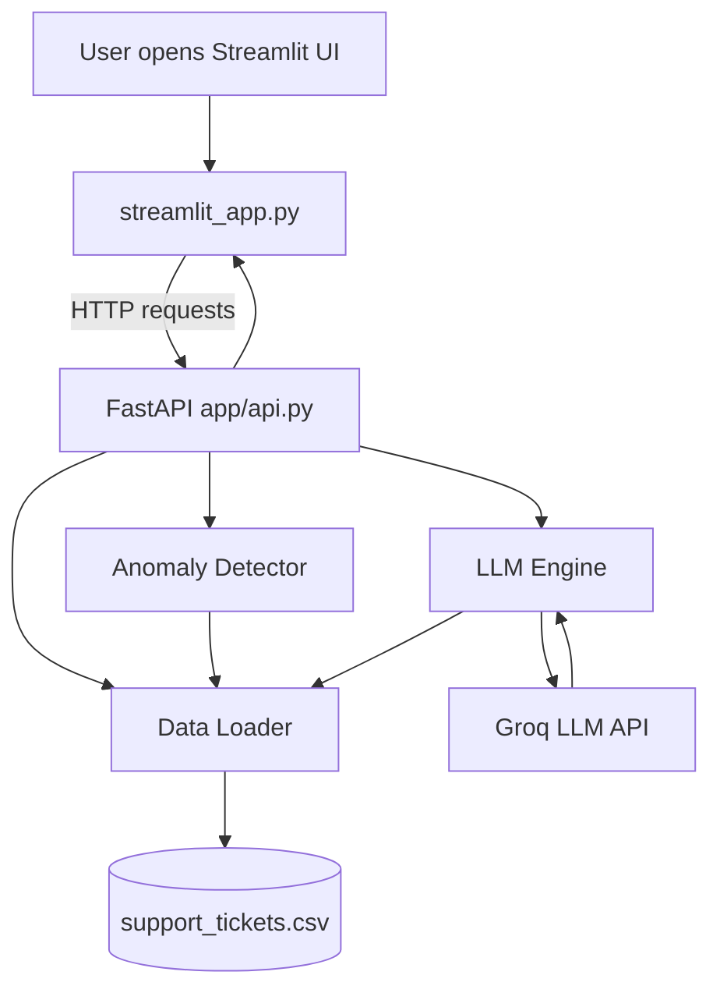
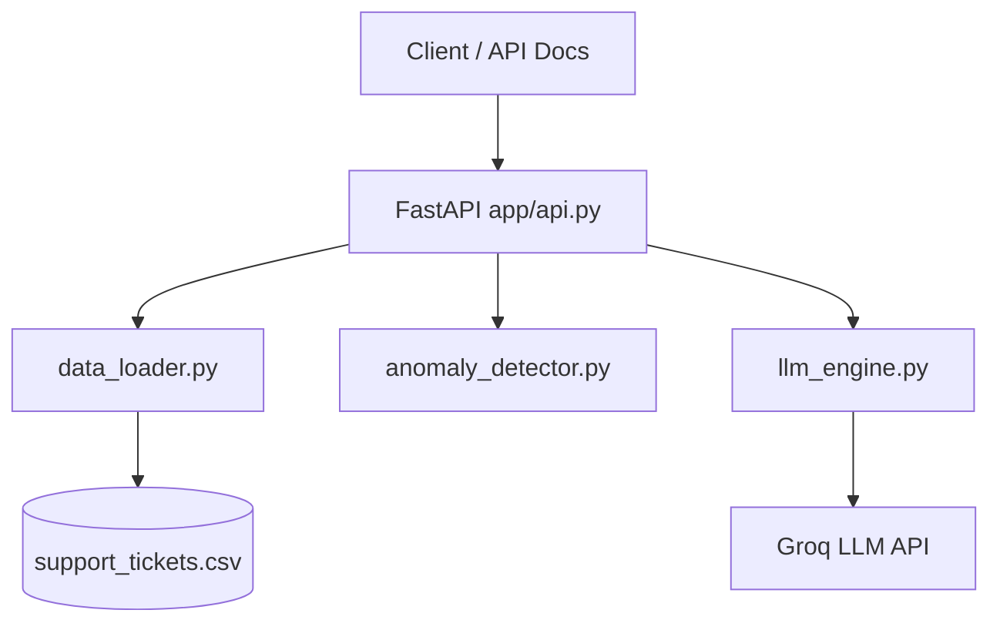
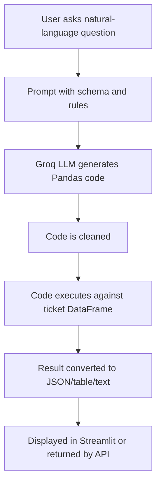

# TicketIQ - AI-Powered Support Ticket Analyzer

TicketIQ is a Python-based AI Support Ticket Analyzer that processes customer support ticket data from CSV files, enables data-driven analysis, answers natural-language questions using an LLM, detects operational anomalies, and provides an interactive Streamlit interface connected to a FastAPI REST backend.

The primary demo starts both services together with `python run.py`. Streamlit acts as the frontend client and calls the FastAPI endpoints for health checks, ticket data, anomalies, and LLM-powered query answers.

---

## Features

- CSV ingestion with Pandas.
- Natural-language ticket analysis using Groq LLM.
- Anomaly detection for escalated tickets, overdue high-priority tickets, and statistical response/resolution-time outliers.
- Python Streamlit dashboard connected to FastAPI with:
  - Ask TicketIQ natural-language query page.
  - Anomaly dashboard.
  - Ticket explorer with filters.
  - CSV download support.
- FastAPI REST API with health, query, anomaly, and ticket endpoints.
- Modular project structure for data loading, anomaly detection, LLM handling, API routing, and UI.

---

## Dataset Summary

The included dataset is `data/support_tickets.csv`.

| Metric | Value |
|---|---:|
| Total tickets | 500 |
| Resolved tickets | 327 |
| Open tickets | 111 |
| Escalated tickets | 62 |
| Medium priority tickets | 169 |
| Low priority tickets | 142 |
| High priority tickets | 134 |
| Critical priority tickets | 55 |
| Detected anomalies | 123 |
| Critical anomalies | 40 |
| High anomalies | 62 |
| Medium anomalies | 21 |

---

## Technology Stack

| Technology | Purpose |
|---|---|
| Python | Main programming language |
| Streamlit | Python UI and dashboard |
| FastAPI | REST API endpoints |
| Pandas | CSV loading, filtering, aggregation, and analysis |
| Groq API | Free-tier LLM provider for natural-language query handling |
| `openai/gpt-oss-120b` | Groq-hosted model used to generate Pandas query code |
| python-dotenv | Environment variable loading |
| Uvicorn | ASGI server for FastAPI |
| CSV | Ticket dataset storage |

---

## Project Structure

```text
TicketIQ/
├── app/
│   ├── api.py
│   ├── data_loader.py
│   ├── llm_engine.py
│   └── anomaly_detector.py
├── data/
│   └── support_tickets.csv
├── test/
│   ├── test_data.py
│   ├── test_anomaly.py
│   └── test_llm.py
├── run.py
├── streamlit_app.py
├── requirements.txt
└── README.md
```

### Module Responsibilities

| File | Responsibility |
|---|---|
| `run.py` | Starts FastAPI and Streamlit together |
| `streamlit_app.py` | Primary Python UI; calls FastAPI endpoints over HTTP |
| `app/api.py` | FastAPI REST API |
| `app/data_loader.py` | Loads `support_tickets.csv` into a Pandas DataFrame |
| `app/anomaly_detector.py` | Detects rule-based and statistical anomalies |
| `app/llm_engine.py` | Builds the LLM prompt, calls Groq, executes generated Pandas code, and formats results |
| `requirements.txt` | Python dependencies |

---

## Setup

### 1. Clone the repository

```bash
git clone https://github.com/ArpanChaudhari/TicketIQ
cd TicketIQ
```

### 2. Create a virtual environment

Windows PowerShell:

```powershell
python -m venv .venv
.\.venv\Scripts\Activate.ps1
```

macOS/Linux:

```bash
python3 -m venv .venv
source .venv/bin/activate
```

### 3. Install dependencies

```bash
pip install -r requirements.txt
```

### 4. Configure Groq API key

Create a `.env` file in the project root:

```env
Groq_API_KEY=your_groq_api_key_here
```

Groq free tier is used for LLM query handling with the `openai/gpt-oss-120b` model. No paid API or paid service is required; the evaluator can run the project at zero cost by creating a free Groq API key.

---

## Running the Application

Run the connected FastAPI + Streamlit system:

```bash
python run.py
```

Then open:

```text
http://localhost:8501
```

This starts:

```text
FastAPI:   http://127.0.0.1:8000
Streamlit: http://localhost:8501
```

The Streamlit app calls the FastAPI backend and covers all major assessment requirements:

- CSV data loading.
- Natural-language questions.
- Anomaly dashboard.
- Ticket browsing and filtering.
- CSV export.

FastAPI docs are available after `python run.py` starts:

```text
http://localhost:8000/docs
```

---

## Walkthrough Notes

Recommended demo flow for the assessment walkthrough:

1. Run `python run.py` to start both FastAPI and Streamlit with one command.
2. Open the Streamlit UI at `http://localhost:8501`.
3. Ask natural-language questions in the Ask TicketIQ page.
4. Review the anomaly dashboard and ticket explorer.
5. Open FastAPI docs at `http://localhost:8000/docs`.
6. Test `/api/health`, `/api/query`, `/api/anomalies`, and `/api/tickets`.
7. Explain the LLM flow: natural-language question -> schema-aware prompt -> generated Pandas code -> structured answer.

---

## API Endpoints

| Method | Endpoint | Purpose |
|---|---|---|
| `GET` | `/api/health` | Returns API status, ticket count, and timestamp |
| `POST` | `/api/query` | Answers a natural-language question using the LLM |
| `GET` | `/api/anomalies` | Returns detected anomaly records |
| `GET` | `/api/tickets` | Returns ticket records with optional filters |

### Example API Requests

Health check:

```http
GET /api/health
```

Natural-language query:

```http
POST /api/query
Content-Type: application/json

{
  "question": "How many tickets are currently open?"
}
```

Ticket filters:

```http
GET /api/tickets?priority=High
GET /api/tickets?status=Open
GET /api/tickets?category=Technical&priority=Critical
```

### Example API Responses

Health check:

```json
{
  "status": "healthy",
  "ticket_count": 500,
  "timestamp": "2026-09-18T16:00:00"
}
```

Natural-language query:

```json
{
  "question": "How many tickets are currently open?",
  "answer": "111",
  "success": true
}
```

Anomaly detection:

```json
{
  "total_count": 123,
  "anomalies": [
    {
      "ticket_id": "TKT-002",
      "anomaly_type": "Escalated Ticket",
      "severity": "High",
      "description": "This ticket has been escalated."
    }
  ]
}
```

---

## Example Questions and Expected Outputs

The Streamlit UI and `/api/query` endpoint can handle questions such as:

| # | Question to Ask | Expected Answer |
|---:|---|---|
| 1 | "How many tickets are currently Open?" | 111 |
| 2 | "How many tickets are Escalated?" | 62 |
| 3 | "How many tickets are in the Billing category?" | 159 |
| 4 | "How many Critical priority tickets are there?" | 55 |
| 5 | "How many tickets have a customer rating below 3?" | 47 |
| 6 | "Which category has the most tickets?" | General - 189 tickets |
| 7 | "What is the average response time across all tickets?" | Approximately 2.62 hours |
| 8 | "What is the average customer rating for Technical category tickets?" | Approximately 3.74 |
| 9 | "Show me the number of tickets per status." | Resolved: 327, Open: 111, Escalated: 62 |
| 10 | "Which agent handles the most tickets?" | AGT-09 - 50 tickets |
| 11 | "Which agent resolved the most tickets?" | AGT-09 and AGT-12 - tied at 37 each |
| 12 | "Show me all Critical tickets that are not resolved." | 31 tickets - a table of Open and Escalated Critical tickets |
| 13 | "What is the average resolution time by priority?" | Critical: approximately 10.6 hrs, High: approximately 13.6 hrs, Medium: approximately 16.9 hrs, Low: approximately 28.5 hrs |
| 14 | "How many Billing tickets are still Open?" | 42 |
| 15 | "Show me all Critical tickets not resolved within 12 hours." | 3 tickets |

---

## Anomaly Detection

TicketIQ combines business-rule detection and statistical outlier detection.

### Rule-Based Checks

1. Escalated tickets:
   - Any ticket with status `Escalated` is flagged as a High severity anomaly.

2. Overdue high-priority open tickets:
   - Open tickets with priority `High` or `Critical` older than 24 hours are flagged as Critical severity.
   - The detector uses the latest `created_at` timestamp in the dataset as the reference time because the dataset is historical.

### Statistical Checks

For `resolution_time_hrs` and `response_time_hrs`, the detector uses the IQR upper-bound rule:

```text
Upper Bound = Q3 + 1.5 * (Q3 - Q1)
```

Values above the upper bound are flagged as Medium severity outliers.

### Current Anomaly Output

| Anomaly Type | Count |
|---|---:|
| Escalated Ticket | 62 |
| Overdue High-Priority Ticket | 31 |
| Overdue Critical-Priority Ticket | 9 |
| Outlier: Resolution Time | 21 |

| Severity | Count |
|---|---:|
| High | 62 |
| Critical | 40 |
| Medium | 21 |

---

## System Architecture



The backend modules remain reusable:



---

## LLM Query Flow



The LLM is instructed to:

- Use the provided Pandas DataFrames.
- Store the final answer in `result`.
- Return only valid Python code.
- Keep DataFrame/Series outputs structured.

---

## Dataset Schema

| Column | Description |
|---|---|
| `ticket_id` | Unique ticket identifier |
| `created_at` | Ticket creation timestamp |
| `category` | Billing, Technical, or General |
| `priority` | Low, Medium, High, or Critical |
| `status` | Open, Resolved, or Escalated |
| `response_time_hrs` | Hours until first response |
| `resolution_time_hrs` | Hours until resolution; missing for unresolved tickets |
| `agent_id` | Assigned support agent |
| `customer_rating` | Post-resolution rating; missing for unresolved tickets |
| `issue_summary` | Short issue description |

---

## Validation Performed

Current local checks:

```bash
python -m py_compile streamlit_app.py app/api.py app/data_loader.py app/anomaly_detector.py app/llm_engine.py
```

The existing files under `test/` are diagnostic scripts. They are useful for manual inspection, but they are not yet full `pytest` test cases.

---

## Known Limitations

- The LLM-generated Pandas code is executed with `exec()`, so it is suitable for a controlled prototype but not for public production use.
- Query results depend on the LLM returning valid code that follows the prompt rules.
- The app currently reads from a local CSV file only.
- Anomaly thresholds are fixed in code.
- Overdue-ticket detection uses the latest dataset timestamp because the CSV is historical.
- The Groq API key must be configured in `.env`.
- Current tests are diagnostic scripts, not full `pytest` test cases.

---

## Future Improvements

- Replace `exec()` with a safer query layer or sandbox.
- Add proper `pytest` unit tests.
- Add Docker Compose for cleaner multi-service startup.
- Make anomaly thresholds configurable.
- Add more charts and trend views.
- Add pagination and server-side filtering for larger datasets.
- Support file uploads or database storage.
- Add authentication, logging, and better production error handling.
